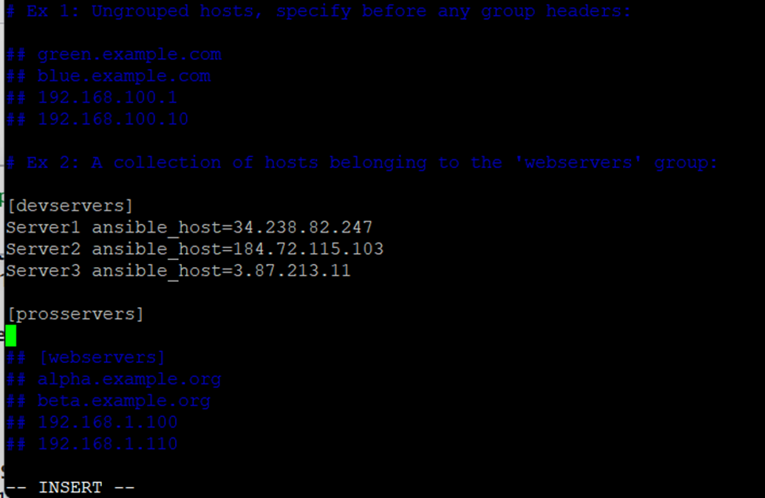

                                                       Ansible Server Management Project

## Project Overview

This project demonstrates how to **update and manage multiple servers remotely using Ansible**.  
Ansible is a **push-based configuration management tool** that allows you to automate tasks, deploy configurations, and manage server environments efficiently.

In contrast, Chef uses a pull-based mechanism.  

### Scenario

- You have **3 servers** to manage remotely.
- You will install Ansible on a **Master server** and push configurations to the other servers.

---

## Workflow

```text
                   +------------------+
                   |   Master Server  |
                   |  (Ansible)       |
                   +--------+---------+
                            |
                            | SSH + PEM key
                            |
        +-------------------+-------------------+
        |                   |                   |
+---------------+   +---------------+   +---------------+
|   Server 1    |   |   Server 2    |   |   Server 3    |
+---------------+   +---------------+   +---------------+

Steps Overview:

1.	Launch 4 EC2 instances: 1 Master + 3 target servers.
2.	Login to Master server via SSH using your .pem key:

ssh -i "key.pem" ubuntu@ec2-3-86-84-251.compute-1.amazonaws.com


Install Ansible on Master:

sudo apt update
sudo apt install software-properties-common -y
sudo add-apt-repository ppa:ansible/ansible
sudo apt update
sudo apt install ansible
ansible --version

Configure Hosts:

1.	Edit the Ansible host file:

                                vim /etc/ansible/hosts

2.	Define your server groups:

                               [servers]
                               server1 ansible_host=PUBLIC_IP
                               server2 ansible_host=PUBLIC_IP
                               server3 ansible_host=PUBLIC_IP

                               Note: You can also put SERVER_NAME instead of PUBLIC_IP

                               

Manage SSH Keys:

1.	Create a directory in Master server:  mkdir ~/keys
2.	Copy .pem keys from your local machine: scp -i "key.pem" key.pem ubuntu@MASTER_SERVER:/home/ubuntu/keys
3.	Set permissions for the key: chmod 400 ~/keys/key.pem
4.	Update the host file with key path and user: 
                                                [servers:vars]
                                                ansible_python_interpreter=/usr/bin/python3
                                                ansible_user=ubuntu
                                                ansible_ssh_private_key_file=/home/ubuntu/keys/key.pem

                                                Note: If we have multiple server groups in host file then we can write: [all:vars]

Test Server Connectivity: ansible servers -m ping
If you get pong, your Master can communicate with all servers.

Run Ad-hoc Commands: ansible servers -a "free -h"           Check free memory
                     ansible servers -a "sudo apt update"   Update servers


Workflow Diagram for Ansible Tasks

Master Server (Ansible)
        |
        |-- Ping Servers
        |-- Run Ad-hoc Commands
        |-- Push Configurations
        |
Target Servers
(server1, server2, server3)


Key Notes
•	Ansible is push-based, unlike Chef (pull-based).
•	You can create groups in the host file for environment-specific tasks.
•	SSH keys allow passwordless connections to remote servers.

---------------------------------------------------------------------------------------------------------------------------------------------------------
ansible-inventory --list

In Ansible, the inventory list is a file that contains the list of servers (hosts) you want to
manage, grouped logically. By default, it’s located at /etc/ansible/hosts, but you can create your
own inventory files anywhere.

Some commands:
1. Ping all servers : ansible all -m ping
2. Ping only webservers: ansible webservers -m ping
3. Run a command on dbservers: ansible dbservers -a "sudo apt update"
4. run playbook: ansible-playbook -v install abc.yml


